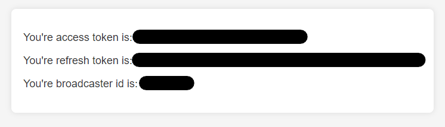

# TwitchCraft
A Minecraft Paper Plugin that allows Twitch viewers to interact with the streamers world without any additional applications required.

### Setup
There are only 3 required configuration variables that need to be set to integrate with Twitch. All 3 can be
easily retrieved from a website I made for this plugin: [TwitchCraft Website](https://streamcraft-0a9a58085ccc.herokuapp.com/)

After logging into Twitch, you will be brought back to my website that tells you what your configuration variables should be. It'll look like this:



Then just copy those codes over to the `twitch_craft.yml` file in the Plugins resource folder and then Boom!! You're ready to 
start letting your viewers interact with your Minecraft world!


<details><summary style="font-weight: bold; font-size: large">Additional Global Plugin Configurations (optional)</summary>

| Configuration                    | Default Value               | Other Example's                         | Description                                                                                                                                                                                                                                                                                                                                                                                                                            |
|----------------------------------|-----------------------------|-----------------------------------------|----------------------------------------------------------------------------------------------------------------------------------------------------------------------------------------------------------------------------------------------------------------------------------------------------------------------------------------------------------------------------------------------------------------------------------------|
| `default_target`                 | `"*"`                       | `player1,player1`<br/>`Crazy_Cranberry` | A comma separated list that allows you to specify which players the [Actions](#actions-optional) should target by default. `"*"` means target all players.                                                                                                                                                                                                                                                                             |
| `connect_to_twitch`              | `true`                      | `true`<br/>`false`                      | Set this to `false` while testing with the [Testing Commands](#testing-commands).                                                                                                                                                                                                                                                                                                                                                      |
| `send_action_message_by_default` | `true`                      | `true`<br/>`false`                      | Whether or not an Action should send a message by default to the player when triggered. This can be override by the action-specific `send_message` configuration.                                                                                                                                                                                                                                                                      |
| `allow_test_commands`            | `false`                     | `true`<br/>`false`                      | Whether or not the [Testing Commands](#testing-commands) should be enabled.                                                                                                                                                                                                                                                                                                                                                            |
| `channel_follows.allow_repeats`  | `false`                     | `true`<br/>`false`                      | Whether or not a viewer unfollowing and refollowing should cause the `CHANNEL_FOLLOW` trigger to trigger again.                                                                                                                                                                                                                                                                                                                        |
| `polls.title`                    | `Which TwitchCraft Action?` |                                         | The title of the Twitch Polls that will be running on your stream.                                                                                                                                                                                                                                                                                                                                                                     |
| `polls.duration_seconds`         | `30`                        |                                         | How long the Twitch Polls should last.<br/>`min: 15`<br/>`max: 1800`                                                                                                                                                                                                                                                                                                                                                                   |
| `polls.seconds_until_next_poll`  | `120`                       |                                         | Interval between polls.                                                                                                                                                                                                                                                                                                                                                                                                                |
| `polls.num_choices`              | `3`                         |                                         | The number of options to be on the poll.<br/>`min: 2`<br/>`max: 5`                                                                                                                                                                                                                                                                                                                                                                     |
| `polls.default_weight`           | `1.0`                       | `10.0`, `0.5`, `4.0`                    | Sometimes you may want certain POLL actions to trigger more or less frequently than others. To handle this scenario, I use a weighting system when randomly deciding which items to put in the poll. If a specific POLL Action does not have a defined `weight`, then this `default_weight` is used as its `weight`. POLL Actions with higher `weight`'s will appear on polls more frequently than POLL Actions with lower `weight`'s. |

</details>

### Actions (optional)
The plugin will come set with the same action configuration that I used in my Stream (notably a small stream). So, if
you'd rather not think and just play, you can ignore this section too. However, there are lots of
cool possible configurations you can do to set up various different unique actions for your stream.


<details><summary style="font-weight: bold; font-size: large">[Configurations that exist on all actions]</summary>

| Configuration         | Required | Description                                                                                                                                                                                                                                                                                                                                                                                                                              |
|-----------------------|----------|------------------------------------------------------------------------------------------------------------------------------------------------------------------------------------------------------------------------------------------------------------------------------------------------------------------------------------------------------------------------------------------------------------------------------------------|
| `type`                | Yes      | The type of action. This is the name in all caps with underscores.<br/>Example: `BUILD_A_HOUSE`                                                                                                                                                                                                                                                                                                                                          |
| `target`              | No       | Comma Separated list of Minecraft User names for this action to target. This overrides the `default_target` configuration. `"*"` will target all players.                                                                                                                                                                                                                                                                                |
| `action_message`      | No       | Use this configuration to override the default message that gets sent to targeted players. You can add [color and other variables](https://github.com/KevinCranmer/TwitchCraft/blob/c58fdd0b8ed0ce2cf6196fca8b149c31a26a348f/src/main/java/me/crazycranberry/twitchcraft/actions/ExecutorUtils.java#L216).<br/>Example: `"{TRIGGER_CAUSE} has triggered {TRIGGER_TYPE}. Let's {COLOR:AQUA}build{COLOR:WHITE} them a {COLOR:GOLD}house!"` 
| `send_message`        | No       | Whether or not this action should send the target players a message when triggered. Defaults to `true`.                                                                                                                                                                                                                                                                                                                                  |
| `trigger.type`        | Yes      | When you want this action to happen. The valid Trigger Types can be found [here](https://github.com/KevinCranmer/TwitchCraft/blob/c58fdd0b8ed0ce2cf6196fca8b149c31a26a348f/src/main/java/me/crazycranberry/twitchcraft/config/TriggerType.java#L14).<br/>Example: `CHANNEL_RESUBSCRIBE`                                                                                                                                                  |
| `trigger.weight`      | No       | This is only used if `trigger.type` is `POLL`. If left blank, then the `polls.default_weight` configuration will be used. Actions with a higher `weight` are more likely to appear in a poll; whereas, Actions with a lower `weight` are less likely to appear in a poll.                                                                                                                                                                |
| `trigger.pollMessage` | No       | This is only used if `trigger.type` is `POLL`. This is the message that appears for this action when it is on a poll. If left blank, it'll use a default message that I've provided for each Action. Max length is `25` characters.                                                                                                                                                                                                      |
| `trigger.min`         | No       | This is only used if `trigger.type` is `CHANNEL_CHEER` or `SUB_GIFT`. A lower bound on the number of bits/subs that need to be donated to trigger this Action. Defaults to `0`.                                                                                                                                                                                                                                                          |
| `trigger.max`         | No       | This is only used if `trigger.type` is `CHANNEL_CHEER` or `SUB_GIFT`. An upper bound on the number of bits/subs that need to be donated to trigger this Action. Defaults to Integer Max Value.                                                                                                                                                                                                                                           |

</details>

<details><summary style="font-weight: bold; font-size: large">Build a House</summary>

`type`: `BUILD_A_HOUSE`


Constructs a house around the targeted player with a random wood type and random wool color. Also
creates a sign out front for whoever triggered this event.

Additional Configuration: `None`
<details><summary>Example Action Configuration</summary>

```
- type: BUILD_A_HOUSE
  action_message: "{TRIGGER_CAUSE} has triggered {TRIGGER_TYPE}. Let's build them
    a {COLOR:GOLD}house!"
  trigger:
    type: CHANNEL_FOLLOW
```

</details>
<br/>
</details>

<details><summary style="font-weight: bold; font-size: large">Can't Stop Won't Stop</summary>

`type`: `CANT_STOP_WONT_STOP`


Sets the players velocity to the direction they are looking. Makes it pretty difficult to stop.

Additional Configuration:

| Configuration      | Required | Description                       |
|--------------------|----------|-----------------------------------|
| `duration_seconds` | Yes      | How long this Action should last. |

<details><summary>Example Action Configuration</summary>

```
- type: CANT_STOP_WONT_STOP
  trigger:
    type: POLL
    weight: 0.5
    poll_message: Zoom Zoom
  duration_seconds: 60
```

</details>
<br/>
</details>

<details><summary style="font-weight: bold; font-size: large">Chest of Goodies</summary>

`type`: `CHEST_OF_GOODIES`


Spawn a chest of goodies in front of the player. The contents of the chest are customizable.

Additional Configuration:

| Configuration           | Required | Description                                                                                                                                                         |
|-------------------------|----------|---------------------------------------------------------------------------------------------------------------------------------------------------------------------|
| `chest_items`           | Yes      | This is a LIST of items using the other configurations in this table                                                                                                |
| `chest_items[*].name`   | Yes      | The name of the item. Must match an ENUM constant from [Material.html](https://hub.spigotmc.org/javadocs/spigot/org/bukkit/Material.html).                          |
| `chest_items[*].chance` | Yes      | The probability that an item appears in the chest. `1.0` is 100% chance and `0.5` is 50% chance and so on.                                                          |
| `chest_items[*].min`    | Yes      | If the item happens to be in the chest (randomly determined from `chest_items[*].chance`), what is the minimum number of this item that should appear in the chest. |
| `chest_items[*].max`    | Yes      | If the item happens to be in the chest (randomly determined from `chest_items[*].chance`), what is the maximum number of this item that should appear in the chest. |

<details><summary>Example Action Configuration</summary>

```
- type: CHEST_OF_GOODIES
  trigger:
    type: POLL
  chest_items:
    - name: LEATHER_HELMET
      chance: 0.4
      min: 1
      max: 2
    - name: LEATHER
      chance: 0.9
      min: 4
      max: 7
    - name: BREAD
      chance: 0.9
      min: 3
      max: 9
```

</details>
<br/>
</details>

<details><summary style="font-weight: bold; font-size: large">Custom Command</summary>

`type`: `CUSTOM_COMMAND`


A customizable command. Whatever you type in for the `command` configuration will be executed on the server. Use `{PLAYER}` and `{PLAYER_LOCATION}` to interpolate respectively. 

Additional Configuration:

| Configuration | Required | Description                                                                |
|---------------|----------|----------------------------------------------------------------------------|
| `command`     | Yes      | The command to be executed (Do **not** include the starting forward slash) |

<details><summary>Example Action Configuration</summary>

```
- type: CUSTOM_COMMAND
  trigger:
    type: CHANNEL_RESUBSCRIBE
  command: summon zombie {PLAYER_LOCATION}
```

</details>
<br/>
</details>

<details><summary style="font-weight: bold; font-size: large">Drop All Items</summary>

`type`: `DROP_ALL_ITEMS`


Drop all a players items around them, a minor inconvenience that could turn ugly quick given certain environments.

Additional Configuration: `None`

<details><summary>Example Action Configuration</summary>

```
- type: DROP_ALL_ITEMS
  trigger:
    type: POLL
```

</details>
<br/>
</details>

<details><summary style="font-weight: bold; font-size: large">Entity Spawn</summary>

`type`: `ENTITY_SPAWN`


Spawn in entities around the player. This could be friendly entities... or 20 withers.

Additional Configuration:

| Configuration        | Required | Description                                                                                                                                                  |
|----------------------|----------|--------------------------------------------------------------------------------------------------------------------------------------------------------------|
| `entity`             | Yes      | The entity to be spawned in. Must match an ENUM constant from [EntityType.html](https://hub.spigotmc.org/javadocs/spigot/org/bukkit/entity/EntityType.html). |
| `quantity`           | Yes      | How many of this entity to be spawned in around the player.                                                                                                  |
| `radius_from_player` | Yes      | How far away the entities should spawn from the player. The entities will spawn in a random spot within this radius.                                         |

<details><summary>Example Action Configuration</summary>

```
- type: ENTITY_SPAWN
  target: Crazy_Cranberry
  trigger:
    type: POLL
    weight: 0.3
    poll_message: Spawn Donkeys!
  entity: DONKEY
  quantity: 3
  radius_from_player: 5
```

</details>
<br/>
</details>

<details><summary style="font-weight: bold; font-size: large">Explosion</summary>

`type`: `EXPLOSION`


Detonate an Explosion centered at the players' location. Players are immune to their own explosions.

Additional Configuration:

| Configuration        | Required | Description                                                                                                          |
|----------------------|----------|----------------------------------------------------------------------------------------------------------------------|
| `power`              | Yes      | How powerful the explosion should be. For reference, TNT is power 4.                                                 |

<details><summary>Example Action Configuration</summary>

```
- type: EXPLOSION
  trigger:
    type: SUB_GIFT
    min: 1
    max: 1
  power: 6 
```

</details>
<br/>
</details>

<details><summary style="font-weight: bold; font-size: large">Flying Cow</summary>

`type`: `FLYING_COW`


Send Flying Exploding Cows at the targeted player! They explode on collision with a block. They can do some serious damage.

Additional Configuration:

| Configuration          | Required | Description                                                                                              |
|------------------------|----------|----------------------------------------------------------------------------------------------------------|
| `num_cows`             | Yes      | How many cows to be thrown at the player.                                                                |
| `seconds_between_cows` | Yes      | How long before the next cow is thrown.                                                                  |
| `distance_from_player` | Yes      | How far away the cows are from the player when launched.                                                 |
| `cow_velocity`         | Yes      | How fast the cow should be traveling. Trajectory is calculated based on this and `distance_from_player`. |

<details><summary>Example Action Configuration</summary>

```
- type: FLYING_COW
  trigger:
    type: POLL
  num_cows: 5
  seconds_between_cows: 5
  distance_from_player: 15
  cow_velocity: 0.9
```

</details>
<br/>
</details>

<details><summary style="font-weight: bold; font-size: large">Give Item</summary>

`type`: `GIVE_ITEM`


Give the player a certain amount of any item.

Additional Configuration:

| Configuration          | Required | Description                                                                                                                         |
|------------------------|----------|-------------------------------------------------------------------------------------------------------------------------------------|
| `item`                 | Yes      | The item type. Must match an ENUM constant from [Material.html](https://hub.spigotmc.org/javadocs/spigot/org/bukkit/Material.html). |
| `quantity`             | Yes      | How many of the item should be given to the player.                                                                                 |

<details><summary>Example Action Configuration</summary>

```
- type: GIVE_ITEM
  trigger:
    type: POLL
    weight: 0.1
  item: DIAMOND_AXE
  quantity: 1
```

</details>
<br/>
</details>

<details><summary style="font-weight: bold; font-size: large">Mega Jump (Paper only)</summary>

`type`: `MEGA_JUMP`


Mega Jump.

Additional Configuration:

| Configuration      | Required                                             | Description                                               |
|--------------------|------------------------------------------------------|-----------------------------------------------------------|
| `num_jumps`        | Either `num_jumps` or `duration_seconds` must be set | How many jumps are mega.                                  |
| `duration_seconds` | Either `num_jumps` or `duration_seconds` must be set | How long mega jump lasts.                                 |
| `end_message`      | No                                                   | A message to let the player know the mega jumps are over. |

<details><summary>Example Action Configuration</summary>

```
- type: MEGA_JUMP
  trigger:
    type: POLL
  num_jumps: 3
  end_message: "No more mega jumps."
```

</details>
<br/>
</details>

<details><summary style="font-weight: bold; font-size: large">No Jumping (Paper only)</summary>

`type`: `NO_JUMPING`

(Do you really need a gif of me running around and not jumping?)

Prevents the player from jumping for a set duration.

Additional Configuration:

| Configuration      | Required | Description                                           |
|--------------------|----------|-------------------------------------------------------|
| `duration_seconds` | Yes      | How long the player will be unable to jump.           |
| `end_message`      | No       | A message to let the player know they can jump again. |

<details><summary>Example Action Configuration</summary>

```
- type: NO_JUMPING
  trigger:
    type: POLL
  duration_seconds: 60
  end_message: "Okay you can jump again."
```

</details>
<br/>
</details>

<details><summary style="font-weight: bold; font-size: large">Piñata Chickens</summary>

`type`: `PINATA_CHICKENS`


Spawn chickens that are one-hittable and drop something random when killed. It could be a trident, or a stick, or even some lava.

Additional Configuration:

| Configuration      | Required | Description                       |
|--------------------|----------|-----------------------------------|
| `num_chickens`     | Yes      | How many Piñata Chickens to spawn |

<details><summary>Example Action Configuration</summary>

```
- type: PINATA_CHICKENS
  trigger:
    type: POLL
    weight: 0.7
  num_chickens: 5
```

</details>
<br/>
</details>

<details><summary style="font-weight: bold; font-size: large">Potion Effect</summary>

`type`: `POTION_EFFECT`


Apply a potion effect to the player.

Additional Configuration:

| Configuration      | Required | Description                                                                                                                                                                                                      |
|--------------------|----------|------------------------------------------------------------------------------------------------------------------------------------------------------------------------------------------------------------------|
| `level`            | Yes      | How strong the potion effect should be.                                                                                                                                                                          |
| `duration_seconds` | Yes      | How strong the potion effect should last.                                                                                                                                                                        |
| `potion_type`      | Yes      | Must match an ENUM constant from [PotionEffectType.html](https://hub.spigotmc.org/javadocs/spigot/org/bukkit/potion/PotionEffectType.html). Or use `RANDOM`, `RANDOM_GOOD`, or `RANDOM_BAD` for a random effect. |

<details><summary>Example Action Configuration</summary>

```
- type: POTION_EFFECT
  trigger:
    type: POLL
    weight: 0.3
  level: 2
  duration_seconds: 45
  potion_type: RANDOM_GOOD
```

</details>
<br/>
</details>

<details><summary style="font-weight: bold; font-size: large">Raid</summary>

`type`: `RAID`


Gives the player the Bad Omen effect and then spawns a villager which triggers a raid.

Additional Configuration:

| Configuration    | Required | Description                                                     |
|------------------|----------|-----------------------------------------------------------------|
| `bad_omen_level` | Yes      | The Bad Omen level to give the player before the raid triggers. |

<details><summary>Example Action Configuration</summary>

```
- type: RAID
  trigger:
    type: POLL
  bad_omen_level: 2
```

</details>
<br/>
</details>

<details><summary style="font-weight: bold; font-size: large">Random Item Removal</summary>

`type`: `RANDOM_ITEM_REMOVAL`


Randomly removes items from the players inventory.

Additional Configuration:

| Configuration   | Required | Description                                  |
|-----------------|----------|----------------------------------------------|
| `num_stacks`    | Yes      | The number of item stacks to remove from.    |
| `num_per_stack` | Yes      | The number of items to be removed per stack. |

<details><summary>Example Action Configuration</summary>

```
- type: RANDOM_ITEM_REMOVAL
  trigger:
    type: POLL
  num_stacks: 2
  num_per_stack: 1
```

</details>
<br/>
</details>

<details><summary style="font-weight: bold; font-size: large">Rotating Hotbar</summary>

`type`: `ROTATING_HOTBAR`


Rotate the players hotbar, making it very annoying to do even the simplest tasks.

Additional Configuration:

| Configuration               | Required | Description               |
|-----------------------------|----------|---------------------------|
| `num_rotations`             | Yes      | The number of rotations.  |
| `seconds_between_rotations` | Yes      | How long before rotating. |

<details><summary>Example Action Configuration</summary>

```
- type: ROTATING_HOTBAR
  trigger:
    type: POLL
  num_rotations: 10
  seconds_between_rotations: 3
```

</details>
<br/>
</details>

<details><summary style="font-weight: bold; font-size: large">Send to Nether</summary>

`type`: `SEND_TO_NETHER`


Send the player to the nether's spawn location. A Return portal is spawned in somewhere nearby to take them back to where they were.

Additional Configuration:

| Configuration                   | Required | Description                                        |
|---------------------------------|----------|----------------------------------------------------|
| `nether_portal_possible_radius` | Yes      | The radius of which the return portal can spawn in |

<details><summary>Example Action Configuration</summary>

```
- type: SEND_TO_NETHER
  trigger:
    type: POLL
  nether_portal_possible_radius: 25
```

</details>
<br/>
</details>

<details><summary style="font-weight: bold; font-size: large">Soup Man</summary>

`type`: `SOUP_MAN`


The soup man really wants soup and you better give it to him.

Additional Configuration:

| Configuration        | Required | Description                                                                                        |
|----------------------|----------|----------------------------------------------------------------------------------------------------|
| `minutes_till_angry` | Yes      | The radius of which the return portal can spawn in.                                                |
| `halfway_message`    | No       | The message to send to the player when half the time has expired.                                  |
| `angry_message`      | No       | The message to send to the player when time has expired and now the soup man will kill the player. |
| `satisfied_message`  | No       | The message to send to the player when they have successfully completed the soup quest.            |

<details><summary>Example Action Configuration</summary>

```
- type: SOUP_MAN
  trigger:
    type: POLL
  minutes_till_angry: 20
```

</details>
<br/>
</details>

<details><summary style="font-weight: bold; font-size: large">WaterLog</summary>

`type`: `WATERLOG`


Constantly spawn water wherever the player is standing. Little goofy, little annoying.

Additional Configuration:

| Configuration       | Required | Description                        |
|---------------------|----------|------------------------------------|
| `duration_seconds`  | Yes      | How long the waterlog should last. |

<details><summary>Example Action Configuration</summary>

```
- type: WATERLOG
  trigger:
    type: POLL
  duration_seconds: 60
```

</details>
<br/>
</details>

<details><summary style="font-weight: bold; font-size: large">Weeping Angel</summary>

`type`: `WEEPING_ANGEL`


Weeping Angels are lethal, indestructible and can only move when you aren't looking at them.

Additional Configuration:

| Configuration          | Required | Description                                                                   |
|------------------------|----------|-------------------------------------------------------------------------------|
| `seconds_till_despawn` | Yes      | How long until the Weeping Angel crumbles away.                               |
| `distance_from_player` | Yes      | How far away the Weeping Angel spawns from the player.                        |
| `end_message`          | Yes      | The message to send to the player to let them know the Weeping Angel is gone. |

<details><summary>Example Action Configuration</summary>

```
- type: WEEPING_ANGEL
  trigger:
    type: POLL
  seconds_till_despawn: 1800
  distance_from_player: 30
  end_message: "The Weeping Angel has withered away."
```

</details>
<br/>
</details>


### Commands

- `TwitchCraftRefresh`: Reloads the twitch_craft.yml configuration so the plugin has the most up-to-date configuration.
- `TwitchCraftReconnect`: Attempt to reconnect to Twitch. For example, after loading the plugin for the first time, you'll 
want to update the twitch_craft.yml with your tokens from [Setup](#setup) and then run `TwitchCraftRefresh` and `TwitchCraftReconnect`.
- `CreatePoll`: Create a poll in twitch. This should happen automatically (after initial startup time), but just in case, you can use this command.

#### Testing Commands

These commands are great for testing out different actions before going live on twitch. You can simulate each Twitch Trigger.
- `ChannelCheer {QUANTITY}`: Triggers an event as if someone just donated `{QUANTITY}` bits.
- `ChannelFollow`: Triggers an event as if someone just followed the channel.
- `ChannelResubscribe`: Triggers an event as if someone just Resubscribed.
- `ChannelSubscribe`: Triggers an event as if someone just Subscribed.
- `PollEnd {WINNING_RESULT}`: Triggers an event as if a Twitch poll just ended and `{WINNING_RESULT}` was the winning option.
- `SubGift {QUANTITY}`: Triggers an event as if someone just gifted `{QUANTITY}` subs.

